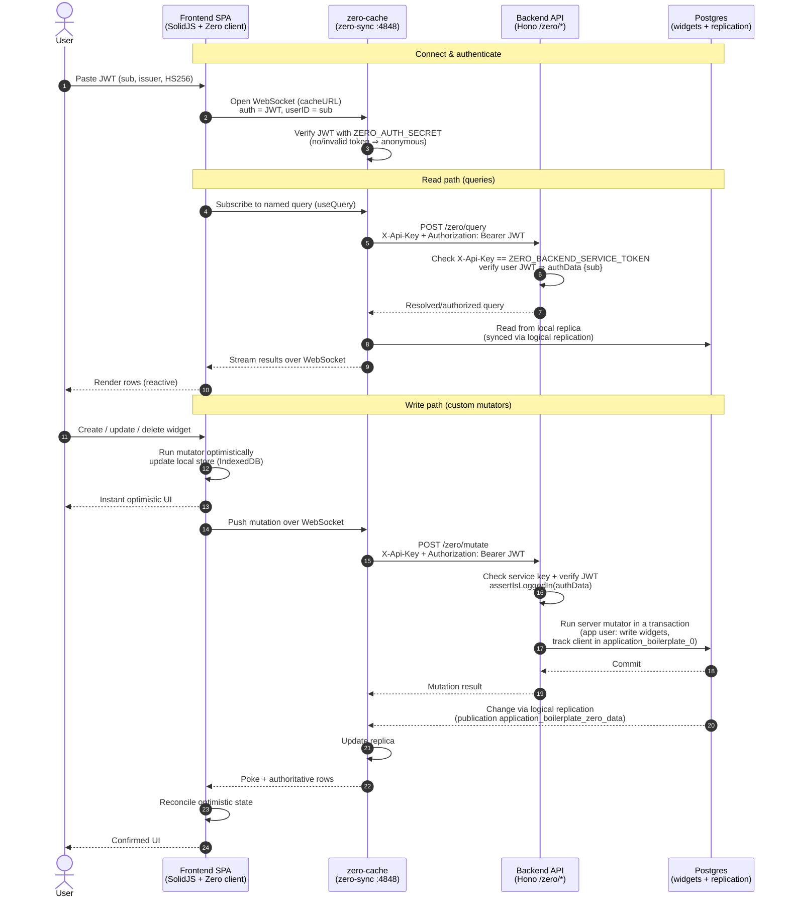

# Data flow

How data moves through application-boilerplate, from the browser frontend to
Postgres and back. The app is a Zero-sync stack with three deployed surfaces plus
the database:

| Surface      | Dev URL                                                              | Role                                                                                                                     |
| ------------ | -------------------------------------------------------------------- | ------------------------------------------------------------------------------------------------------------------------ |
| Frontend SPA | `application-boilerplate.development.konker.dev`                     | Static SolidJS build (S3 + CloudFront). Holds the Zero client.                                                           |
| zero-cache   | `zero-sync.application-boilerplate.development.konker.dev` (`:4848`) | Sync engine. Verifies the user JWT, serves reads from a replica, relays mutations, replicates from Postgres.             |
| Backend API  | `api.application-boilerplate.development.konker.dev`                 | Hono app exposing `/zero/query` and `/zero/mutate` (plus `/`, `/foo`, `/ping`). Server-authoritative queries + mutators. |
| Postgres     | reached via `ssh-tunnel-proxy`                                       | Source of truth (`widgets` table). Logical-replication publication feeds zero-cache.                                     |

Two trust boundaries matter:

- **User auth** — an HS256 JWT (issuer `application-boilerplate-development`, minted
  out-of-band) is verified by zero-cache (`ZERO_AUTH_SECRET`) _and_ re-verified by the
  backend (`JWT_SIGNING_SECRET` / `JWT_ISSUER`). `sub` is the user id.
- **Service auth** — zero-cache calls the backend with `X-Api-Key`
  (`ZERO_QUERY_API_KEY` / `ZERO_MUTATE_API_KEY`), which the backend checks against
  `ZERO_BACKEND_SERVICE_TOKEN`, proving the request came from zero-cache and not a
  browser hitting `/zero/*` directly.

## Notes

- **Same-vs-cross origin.** The browser only talks to two origins directly: the
  WebSocket to zero-cache and (indirectly) the backend. The `/zero/query` and
  `/zero/mutate` calls are made **server-to-server by zero-cache**, not by the
  browser — so no backend CORS is needed. The only browser cross-origin lever is the
  CloudFront `connect-src` CSP allowing the zero-cache `https`/`wss` origin.
- **Optimistic then authoritative.** The same mutator function runs twice: instantly
  on the client against the local store, then authoritatively on the backend inside a
  DB transaction. zero-cache reconciles the two once the committed change replicates
  back, so a rejected mutation (e.g. `assertIsLoggedIn` failing) rolls the optimistic
  change back.
- **Replication, not direct writes from zero-cache.** zero-cache never writes app
  rows itself; the backend mutator owns writes. zero-cache learns about committed
  changes through Postgres logical replication and maintains its own replica + the
  `application_boilerplate_0` shard schema (client/mutation tracking).
