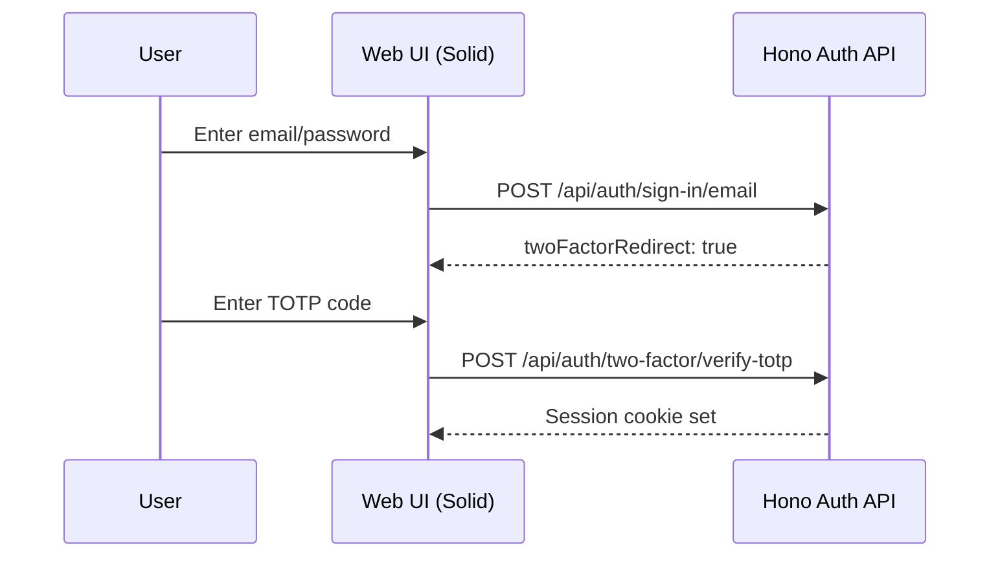
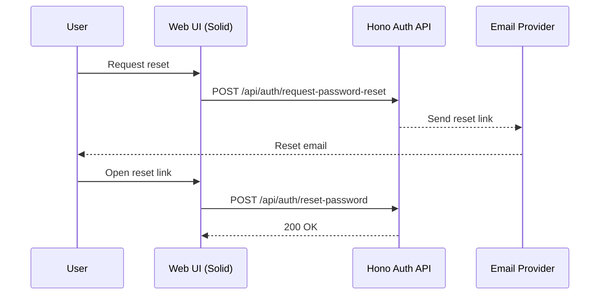
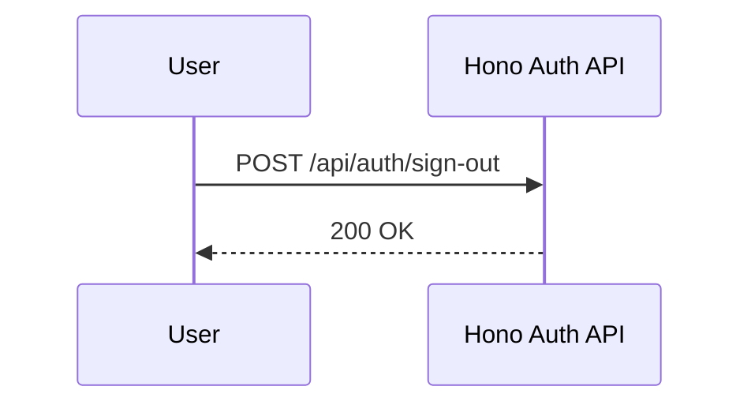
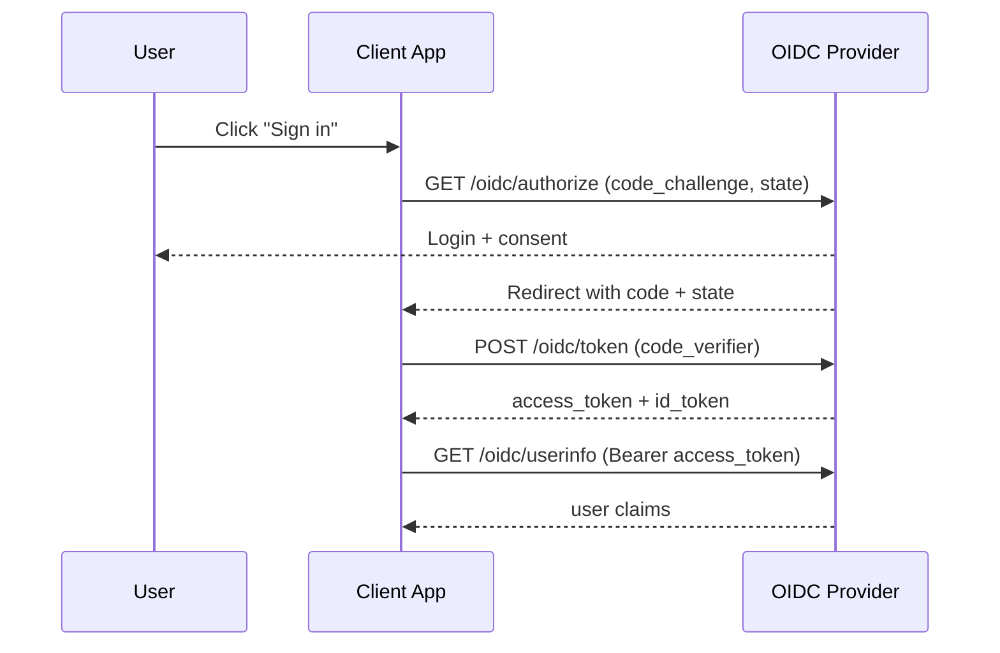

# auth.konker.dev Hono Auth API

This document defines the HTTP API blueprint for the Hono-based auth service described in `docs/SPEC.md`.
It covers the auth API under `/api/auth` and the OIDC provider under `/oidc`. OIDC endpoints are
implemented by better-auth and documented here for integration clarity.

## Scope
- Public auth endpoints (email/password sign-up, sign-in, sign-out)
- Session access (get session)
- Password reset and change password
- MFA via better-auth two-factor plugin (TOTP + backup codes)
- Invite-only registration support (custom)
- Admin endpoints (better-auth admin plugin)
- OIDC provider endpoints (prefixed `/oidc`)

## Base URL and versioning
- Base path: `/api/auth`
- Versioning: not applied. Use a new base path if a breaking change is required.

## Conventions
- Content-Type: `application/json` unless the endpoint is OIDC (`application/x-www-form-urlencoded` on `/oidc/token`).
- All timestamps are ISO 8601 UTC strings.
- For endpoints backed by better-auth, use better-auth request/response and error formats without
  wrapping or renaming fields.
- Custom endpoints must follow the same field naming conventions and error format as better-auth.

## better-auth integration guidance
Use better-auth to provide core auth behavior; Hono hosts the HTTP surface and adds app-specific
features (invites, admin, auditing).

Recommended integration steps:
1) Initialize better-auth with a Drizzle Postgres adapter and the same user schema defined in
   `docs/SPEC.md`.
2) Set `basePath` to `/api/auth` (default) unless a different mount point is required.
3) Enable email/password, email verification, and password reset flows; wire email delivery via
   a provider adapter (SMTP or API).
4) Configure session and cookie options (cookie prefix, secure cookies, stateless cookie cache as needed).
5) Mount better-auth handlers under `/api/auth/*` and `/oidc/*` inside Hono routes.
6) Use better-auth events/hooks (or Hono middleware) to emit audit logs for login, MFA, password
   reset, role changes, and email verification.
7) Implement custom endpoints not provided by better-auth (invites) using the same DB/Drizzle layer.

Mapping guidance:
- Sign-up/sign-in/sign-out, session access, password reset, email verification, two-factor: use
  better-auth built-ins and keep request/response formats unchanged.
- Hono may set cookies or headers, but must not remap payloads.
- OIDC endpoints: use better-auth OIDC provider mounted under `/oidc`.

## Auth and session model
- Better-auth uses cookie-based sessions by default.
- Cookie names are prefixed: `${prefix}.${cookie_name}` with default prefix `better-auth`.
- Default cookies include `session_token`, `session_data` (when cookie cache is enabled), and
  `dont_remember` (when `rememberMe` is disabled).
- Two-factor plugin uses a `two_factor` cookie to track 2FA state.
- Stateless sessions are supported via cookie cache strategies (`compact`, `jwt`, `jwe`).

## Rate limiting and abuse controls
- Apply IP + identifier rate limits on:
  - `POST /api/auth/sign-in/email`
  - `POST /api/auth/sign-up/email`
  - `POST /api/auth/request-password-reset`

## Endpoints

### Auth API endpoints (`/api/auth`)

#### better-auth pass-through endpoints
These routes are exposed as-is from better-auth. Request/response payloads and error formats must
match better-auth defaults without wrapping or renaming fields.

##### Email/password
- `POST /sign-up/email`
  - Body: `name`, `email`, `password`, optional `image`, optional `callbackURL`
- `POST /sign-in/email`
  - Body: `email`, `password`, optional `rememberMe` (default `true`), optional `callbackURL`
  - If 2FA is enabled, response includes `twoFactorRedirect: true`
- `POST /sign-out`
  - No body

##### User profile
- `POST /update-user`
  - Body: `name`, `image`, plus any additional user fields configured in better-auth

##### Session access
- `GET /get-session`
  - Query: optional `disableCookieCache` (boolean)
- `GET /list-sessions`
  - Returns active sessions for the current user
- `POST /revoke-session`
  - Body: `token`
- `POST /revoke-sessions`
  - Revokes all sessions for the current user
- `POST /revoke-other-sessions`
  - Revokes all sessions except the current one

##### Password reset and change password
- `POST /request-password-reset`
  - Body: `email`, optional `redirectTo`
- `POST /reset-password`
  - Body: `newPassword`, `token`
- `POST /change-password`
  - Body: `newPassword`, `currentPassword`, optional `revokeOtherSessions`

##### Email verification
- `POST /send-verification-email`
  - Body: `email`, optional `callbackURL`
- `GET /verify-email`
  - Query: `token`, optional `callbackURL`

##### Two-factor (better-auth two-factor plugin)
- `POST /two-factor/enable`
  - Body: `password`, optional `issuer`
- `POST /two-factor/get-totp-uri`
  - Body: `password`
- `POST /two-factor/verify-totp`
  - Body: `code`, optional `trustDevice`
- `POST /two-factor/generate-backup-codes`
  - Body: `password`
- `POST /two-factor/verify-backup-code`
  - Body: `code`, optional `disableSession`, optional `trustDevice`
- `POST /two-factor/disable`
  - Body: `password`

Optional OTP-based 2FA endpoints (if configured):
- `POST /two-factor/send-otp`
-  - Body: optional `trustDevice`
- `POST /two-factor/verify-otp`
-  - Body: `code`, optional `trustDevice`

#### Custom endpoints

##### POST `/invites/accept`
Accepts an invite and creates the user using better-auth registration under the hood.

Request:
```json
{
  "inviteToken": "invite-token",
  "email": "user@example.com",
  "password": "string",
  "name": "Name"
}
```

Response: `201`

##### Admin plugin session endpoints (better-auth admin plugin)
These endpoints are available only when the better-auth admin plugin is enabled.

- `POST /admin/list-user-sessions`
  - Body: `userId`
  - Response: `{ sessions: Session[] }`
- `POST /admin/revoke-user-session`
  - Body: `sessionToken`
  - Response: `{ success: boolean }`
- `POST /admin/revoke-user-sessions`
  - Body: `userId`
  - Response: `{ success: boolean }`

##### Admin plugin user endpoints (better-auth admin plugin)
- `POST /admin/create-user`
  - Body: `email`, `password`, `name`, optional `role`, optional `data`
- `GET /admin/get-user`
  - Query: `id`
- `POST /admin/update-user`
  - Body: `userId`, `data`
- `GET /admin/list-users`
  - Query: `searchValue`, `searchField`, `searchOperator`, `limit`, `offset`, `sortBy`, `sortDirection`, `filterField`, `filterValue`, `filterOperator`
- `POST /admin/set-role`
  - Body: `userId`, `role`
- `POST /admin/set-user-password`
  - Body: `userId`, `newPassword`
- `POST /admin/ban-user`
  - Body: `userId`, optional `banReason`, optional `banExpiresIn`
- `POST /admin/unban-user`
  - Body: `userId`
- `POST /admin/remove-user`
  - Body: `userId`
- `POST /admin/impersonate-user`
  - Body: `userId`
- `POST /admin/stop-impersonating`
  - No body
- `POST /admin/has-permission`
  - Body: `permissions` (or deprecated `permission`), optional `userId`, optional `role`

### OIDC provider endpoints (`/oidc`)

#### Base URL
- Issuer: `https://auth.konker.dev/oidc`
- OIDC endpoints are mounted under `/oidc`

#### Supported flows
- Authorization Code + PKCE (required for browser clients)
- Refresh token grant (optional per client)
- Client Credentials flow is out of scope for this project

#### Client types
- Public clients: require PKCE; no client secret
- Confidential clients: client secret required for token exchange
- Redirect URIs must be pre-registered and matched exactly

#### Discovery
- `/oidc/.well-known/openid-configuration` exposes issuer, endpoints, supported scopes, and signing algorithms

#### Endpoints
- `GET /oidc/authorize`
- `POST /oidc/token`
- `GET /oidc/userinfo`
- `GET /oidc/jwks.json`
- `GET /oidc/logout`

#### Scopes and claims
- Required scopes: `openid`, `profile`, `email`
- Optional scopes: `roles`
- Standard claims: `sub`, `email`, `email_verified`, `name`, `preferred_username`, `picture`
- Custom claims: `roles` (array of strings)

#### Tokens
- Access token: JWT signed with rotating keys (JWS)
- ID token: JWT signed with rotating keys (JWS)
- Refresh token: opaque with rotation (configurable per client)
- Default lifetimes: access 15m, ID 15m, refresh 30d

#### Logout
- Front-channel logout via `GET /oidc/logout`
- Accepts `id_token_hint`, optional `post_logout_redirect_uri`, and `state`
- Redirect URIs must be pre-registered per client

#### Error handling
- Use standard OIDC error responses (`invalid_request`, `invalid_client`, `invalid_grant`, etc.)
- Include `error` and `error_description` in JSON for token/userinfo responses

## Mermaid diagrams

### Login with MFA (TOTP)


### Password reset


### Sign out


### Authorization Code + PKCE

